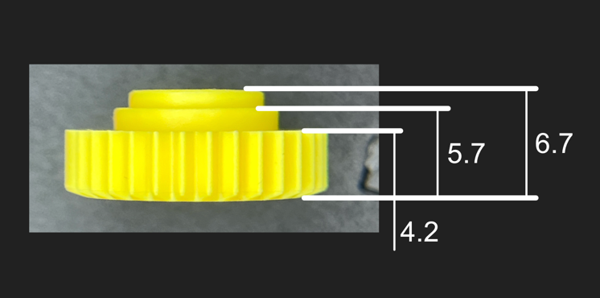
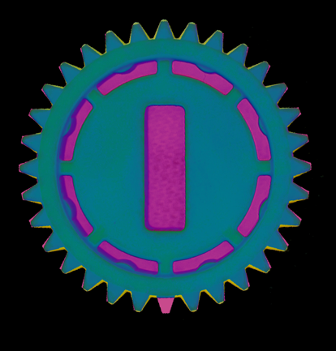

# nuke-ultra-adapter

The goal of this project is to create adapters for the smart lock ultra.

I use a `Keso 8000` Lock, that I like to use with the Nuki Ultra.

## Nuki Ultra Parts

### Gear

- 32 Tooth

#### Self-made Gear

## Keso 8000 Adapter

- Status: `Prototype ordered`
- OpenSCAD: [keso-gear-adapter.scad](keso-gear-adapter.scad)
- STL: [keso-gear-adapter.stl](keso-gear-adapter.stl)
