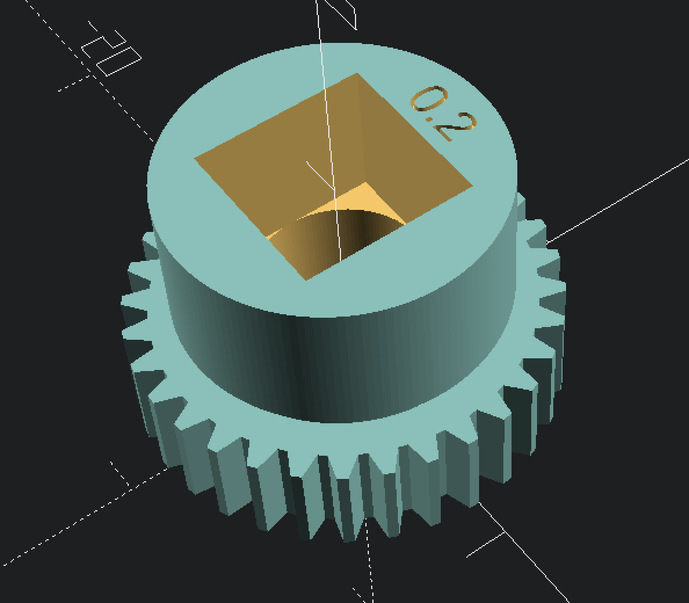

# nuki-ultra-adapter

The goal of this project is to create adapters for the smart lock ultra.

I use a `Keso 8000` Lock, that I like to use with the Nuki Ultra.

Use the models at your own risk. I am not responsible for any damage or harm caused by using the models.

## Prototype

### Base Plate

### Keso Adapter

## Nuki Ultra Parts

### Gear

- 32 Tooth

#### Self-made Gear

This is a test image to see if the shape of the self-made gear fits the original gear.
It is almost perfect.

## Keso 8000 Adapter

- Status: `Prototype ordered`
- OpenSCAD: [../keso-gear-adapter.scad](keso-gear-adapter.scad)
- STL: [../keso-gear-adapter.stl](keso-gear-adapter.stl)
